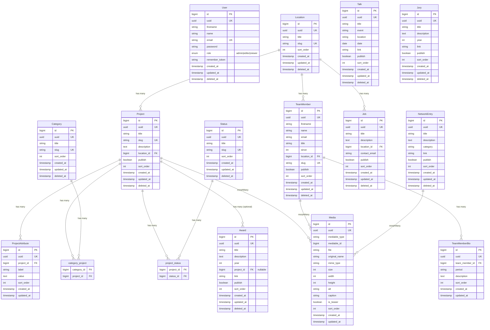

# Database ER Diagram

## Relationship Legend

| Relationship | Type | Description |
|--------------|------|-------------|
| Location → Project | One-to-Many | Each project belongs to one location |
| Location → TeamMember | One-to-Many | Each team member belongs to one location |
| Location → Job | One-to-Many | Each job belongs to one location |
| Project → ProjectAttribute | One-to-Many | Projects have dynamic key-value attributes |
| Project ↔ Category | Many-to-Many | Via `category_project` pivot |
| Project ↔ Status | Many-to-Many | Via `project_status` pivot |
| Project → Media | Polymorphic | Projects can have multiple images |
| TeamMember → TeamMemberBio | One-to-Many | CV entries for each member |
| TeamMember → Media | Polymorphic | Portrait image |
| NetworkEntry → Media | Polymorphic | Logo image |
| Project → Award | One-to-Many (optional) | Awards can link to a project |

## Notes

- All entities have `uuid` for external API exposure
- Integer `id` used internally for foreign keys and relations
- `Media` is polymorphic via `mediable_type` and `mediable_id`
- Soft deletes (`deleted_at`) on most entities for trash/restore
- `sort_order` on all sortable entities for drag-drop ordering
